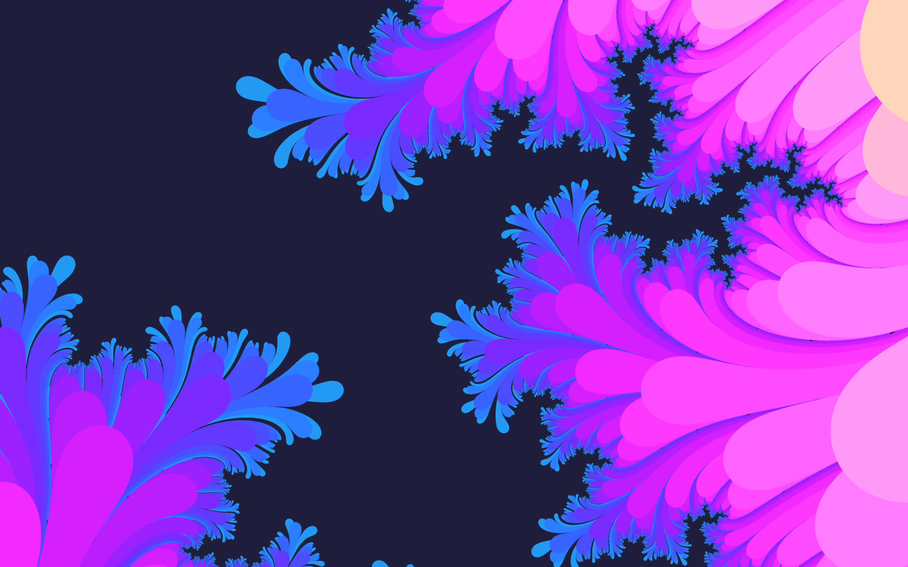

# My Dear Shaders
GLSL fragment shaders\
The beauty of mathematics\
The code is pretty much experiments and exploration

## Usage & VSCode SetUp
You can install evrything from VSCode package manager

* Install [Shader languages support for VS Code](https://github.com/stef-levesque/vscode-shader)

#### Using [Canvas](https://marketplace.visualstudio.com/items?itemName=HookyQR.beautify)
* Install [glsl-canvas](https://marketplace.visualstudio.com/items?itemName=HookyQR.beautify)
* Open the `.frag` file code, press `F1` and type `Show glslCanvas`

Canvas is convenient for live coding and playing around, but a little weird with the window UV coordinate system.

#### Using [glsl Viewver](https://github.com/patriciogonzalezvivo/glslViewer) (MacOS and Linux only)
* `brew install glslviewer` or `sudo apt instal glslviewer` for Linux
* `$> glslviewer <filename>.frag` or \
`$> glslViewer -w <width resolution> -h <high resolution> <filename>.frag`

## Shaders

Ray Marching Sphere        |  Mandelbrot Flower        |            Mandelbrot Set |           
:-------------------------:|:-------------------------:|:-------------------------:|
  |    |   |

Julia Set                  |  Mandelbrot Lens          |                      Flow |           
:-------------------------:|:-------------------------:|:-------------------------:|
  |  |   |

Flow-2                     |  Circs                    | Japan                     |           
:-------------------------:|:-------------------------:|:-------------------------:|
      |     |     |
 
A neat Mandelbrot wallpaper\

